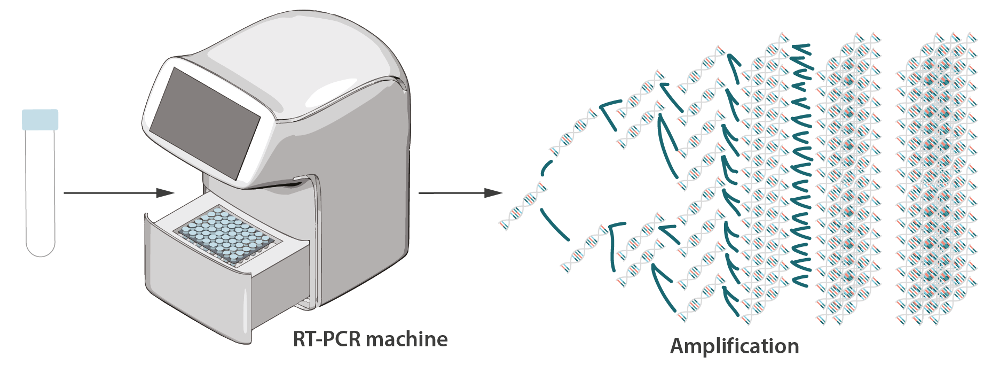

= Exercise: COVID Testing
:includedir: ../../../includes
:source-highlighter: rouge
:stem:
:toc: left

++++
include::{includedir}/navigation.html[]
++++

== Background

Severe acute respiratory syndrome coronavirus 2 (SARS-CoV-2) is the virus that causes coronavirus disease 2019 (COVID-19), the respiratory illness responsible for the COVID-19 pandemic. The World Health Organization declared the outbreak a Public Health Emergency of International Concern on 30 January 2020, and a pandemic on 11 March 2020.

In the United States factors such as discrimination, healthcare access and use, general health status, education, income, and wealth gaps put some racial and ethnic minority groups at increased risk of severe illness from COVID-19, including death. footnote:[COVID-19 Racial and Ethnic Health Disparaties (2020). Centers for Disease Control https://www.cdc.gov/coronavirus/2019-ncov/community/health-equity/racial-ethnic-disparities/index.html]

One of the most widespread and reliable forms of COVID-19 testing is called
*Real-time polymerase chain reaction* or RT-PCR, which analyzes samples from inside the nose to assess the current presence of SARS-CoV-2. The test works by isolating the RNA of the virus, converting the RNA to DNA using reverse transcription, and then amplifying the DNA thousands of times so it can be detected.

The success of the testing is dependent on three factors footnote:[Bustin, S. A. and Mueller R. (2005). Real-time reverse transcription PCR (qRT-PCR) and its potential use in clinical diagnosis. *Clinical Science* 23, 365-379. https://gene-quantification.de/bustin-mueller-qpcr-2005.pdf]:

* **sample quality**: collection, preparation, transport and RNA extraction methods
* **primer selection**: chosen method for reverse transcribing the RNA to DNA
* **calibration**: threshold settings for instruments must be monitored and tested.

You are working as a software developer in a biomedical lab where you are maintaining a set of data utilities that allows lab technicians to report the results from RT-PCR tests in order to generate statistics about SARS-CoV-2 testing. You've been told by the director that the lab has been generating a large number of incorrect results (false positives and false negatives). 

The program collects test results, sample quality and calibration times from lab technicians and should only record a test result when:

1. The sample quality is **greater than .9**
2. The time (hours) since last calibration is **less than 5**.

If either of these things is false the program should not record the result and should exit immediately with an error.

== Instructions

Examine the link:covid_testing.py[source code] for the data entry program and answer the following questions:

1. Describe any problems you see with the program that would cause it to report incorrect test results? (3 points)
2. The Director would like you to adapt the program to collect information about the race, gender and income of the test subject. Please describe in English how you might do that and what some of the problems might be. (3 points)
3. Submit a corrected and improved version of the program where the bugs are removed and where you have started to collect demographic information. (4 points)
