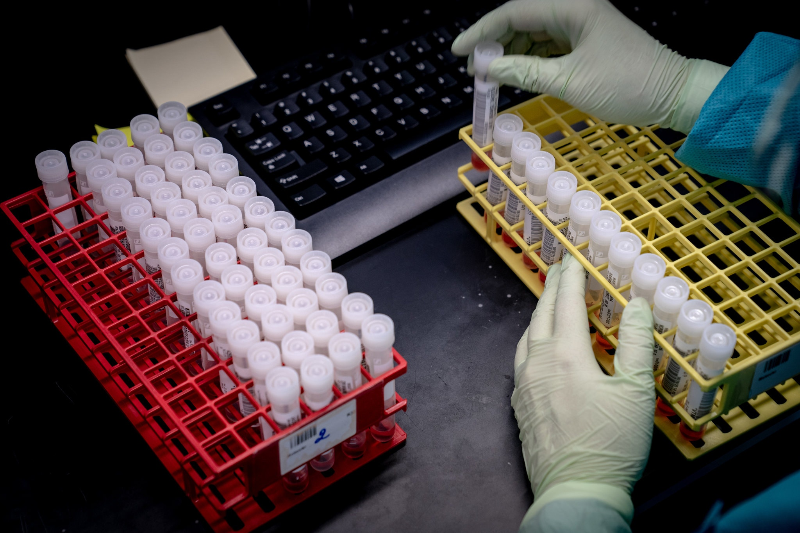

= Exercise: COVID Testing
:includedir: ../../../includes
:source-highlighter: rouge
:stem:
:toc: left

++++
include::{includedir}/navigation.html[]
++++

== Background

Congratulations, you have successfully identified the cause of the errors in
the COVID test results data collection program. Based on your advice the
director has decided to wait to add the collection of demographic information
to the program since it is currently unclear what categories to use for
ethnicity and gender. The director was so pleased with your work that she has
promoted you to be the head of the new data processing department for the lab.

This morning the director called a meeting of all the department heads to
announce new rules that have been issued by the White House that require all
test results to be sent to the Department of Health and Human Services instead
of the Centers for Disease Control. footnote:[Stolberg, Sheryl G. (2020, July 14). Trump Administration Strips C.D.C. of Control of Coronavirus Data. New York Times.
https://www.nytimes.com/2020/07/14/us/politics/trump-cdc-coronavirus.html]

You’ve been asked to adjust the data collection program to persist the test
results to a file named covid-results.txt. Every night this file will be
automatically picked up and sent to HHS on behalf of client hospitals and then
deleted. HHS would like the data to be in a comma delimited format where each
line in the file represents a test result including:

1. Name
2. Test Result: 1 (positive) or 0 (negative)
3. Sample Quality: 0.0 - 1.0
4. Last Equipment Calibration (Hours): A positive integer

For example here are three test results:

    Ed Summers,1,.91,4
    Michael Knight,0,.92,3
    Bonnie Knight,0,.91,2

When the program runs it should allow a user to enter data, and then on exiting it should append the data to covid-results.csv. It is important for it to append or else it could erase data from a previous run.
Instructions

== Instructions

Examine the updated link:covid_testing.py[source code] and complete the
following steps:

1. One of your colleagues has modified the data collection program to store the
test results in a list. But they have asked for your help in writing the
function to save the data. Fill in that function marked with a TODO. (5 points) 

2. In no less than 150 words please describe what some potential problems or
pitfalls might be encountered with this data processing pipeline. For
example, how resilient or adaptable is the format of the data file? What could be
done to better describe the contents of the file? Could another
data format work better? What problems might there be with how the data is sent off
each night? How many people could use this program at the same time? These
questions are just examples, which you may choose to answer, but you can also come up
with your own. Try to think creatively and defensively about how this program
might be used. (5 points)

