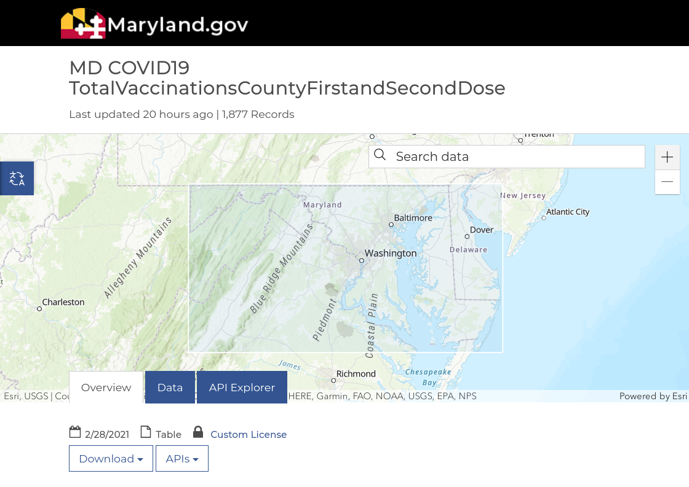

= Exercise: Vaccination Amomalies
:includedir: ../../../includes
:source-highlighter: rouge
:stem:
:toc: left

++++
include::{includedir}/navigation.html[]
++++

== Background

Your work in the COVID testing lab has given you lots of experience collecting
data from the testing facility. You recently updated your LinkedIn profile with
some of this work. You also asked the Lab director if she would give you a
recommendation on your profile. She obliged and wrote a generous message about
your work to not just collect the data but to automatically ensure that it is
valid.

The next day a recruiter sent you an update asking if
you would be interested in a position helping an organization called
link:https://crisphealth.org/[CRISP] develop its data acquisition and reporting
tools. CRISP is a non-profit that works as a
link:https://en.wikipedia.org/wiki/Health_information_exchange[Health
Information Exchange] (HIE). A HIE aggregates health data for a region or
community in order to make it available to public health officials. The State of
Maryland has contracted with CRISP to collect and aggregate all the COVID test
results and vaccination medical records for tracking.

After careful consideration you've decided to join CRISP. On your first day you
are assigned to a team that is responsible for detecting anomalies in COVID
related data that is being collected by CRISP from counties in Maryland. The
Maryland Department of Health is using a product called
link:https://www.esri.com/en-us/arcgis/products/arcgis-hub/overview[ArcGIS Hub]
to make COVID related data that CRISP has collected available to the public in a
dashboard. You can see the dashboard at https://coronavirus.maryland.gov/

On December 11, 2020 the first vaccine was cleared for use in the United States
by the Federal Drug Administration. footnote:[Thomas, K., LaFraniere, S.,
Weiland, N., Goodnough, A and Haberman M. (December 11, 2020). F.D.A. Clears
Pfizer Vaccine, and Millions of Doses Will Be Shipped Right Away. New York
Times.
https://www.nytimes.com/2020/12/11/health/pfizer-vaccine-authorized.html]
Your first assignment is to look at a county level vaccination dataset and
analyze it to identify any problems.

__The cumulative number of COVID-19 vaccinaions within a single Maryland
jurisdiction.__ +
https://coronavirus.maryland.gov/datasets/md-covid19-totalvaccinationscountyfirstandseconddose

== Instructions

Download the CSV dataset from the
link:https://coronavirus.maryland.gov/datasets/md-covid19-totalvaccinationscountyfirstandseconddose[Maryland
Department of Health]. When answering the following questions remember this
weeks work using Python sets.

1. What significant data quality problem do you see in this dataset? (2 points)

2. What counties seem to be responsible for this problem? (2 points)

3. What counties do not seem to be responsible for this problem? (2 points)

4. In no less than 150 words please describe a scenario or scenarios where these
problems could happen? Think about how data like this might get generated and
speculate about what could go wrong (use your imagination). (3 points)

5. Do you see any other problems with the dataset? (1 point)
