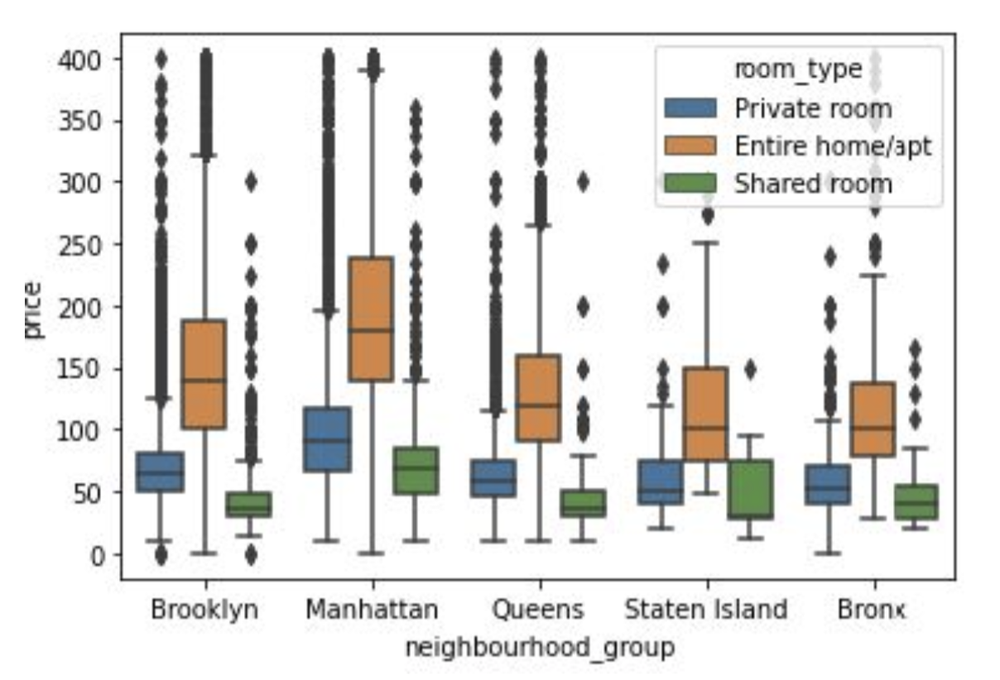
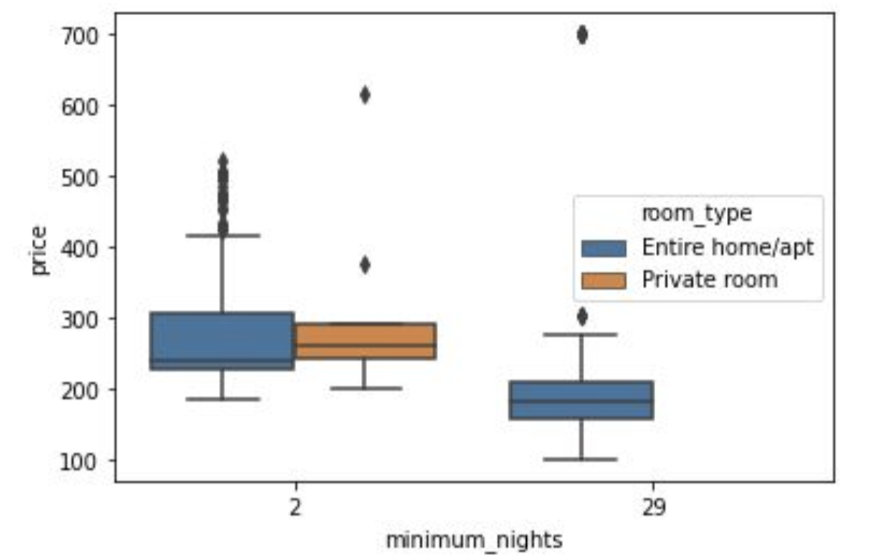

= Exercise: AirBnb
//:stylesdir: ../../css
//:stylesheet: page.css
:includedir: ../../../includes
:source-highlighter: rouge
:stem:
:toc: left

++++
include::{includedir}/navigation.html[]
++++

== Background

For this exercise we will perform some data exploration on a dataset containing information for NYC Airbnb rentals. You can find the CSV file link:../files/AB_NYC_2019.csv[here]. The final script should be a python file that performs all the requirements as listed in the script instructions. You may find that it is easiest to explore data using a jupyter notebook/IPython notebook. It is completely encouraged that you do the majority of the data exploration in a notebook and then transfer your code to a script that we can run from the terminal. You may access the seaborn documentation for help making plots here: link:https://seaborn.pydata.org/[Seaborn Documentation]

== Instructions

* import seaborn
* import pandas
* **Requirement 1:**
	** Export a boxplot that will display a boxplot for every neighborhood group’s price for listings where the prices are below 400. Make sure that every room type also gets its own boxplot for each neighborhood group. Save this boxplot as “boxplot1.png” on your current working directory.
		*** Note: What information can you gather from this box plot?
	** The resulting graph should look something like this:
        *** 
* **Requirement 2:**
	** A couple of the hosts seem to be creating multiple listings. We may need to identify who these hosts are to make sure that they are using the Airbnb platform appropriately.
	** Identify the 2 host id’s with the highest count of listings. There are plenty of ways to do this, however, you may find it easiest to group the dataframe by the host id and summarize the groupings by using the count() method. This gives you the count of instances of the host_id. Then you can sort the data frame based on the count to identify the two highest manually.
	** Create 2 separate data frames,  containing listings pertaining to the two user ids with the highest amount of listings.
	** For each data frame export a boxplot for the prices of the user’s listings. Make sure to separate out the boxplots for each minimum stay amount. Make sure that every room type also gets its own boxplot foreach minimum stay. Save these boxplots as “boxplot2.png” and “boxplot2.png” on your current working directory.
		*** Note: What information can you gather from these plots?
	** The resulting graphs should look something like this:
        *** 
	** Note: Explore the two users, after a quick google search, what can you tell me about who those two users are?

=== Note
* Box and whisker plots are not explicitly mentioned in the lectures. Part of the goal of this exercise is to learn to dig through documentation that is available to us publicly. For information on creating a box and whisker plot using seaborn please reference the documentation which has very thorough explanations on how to make the different types of graphs and plots.